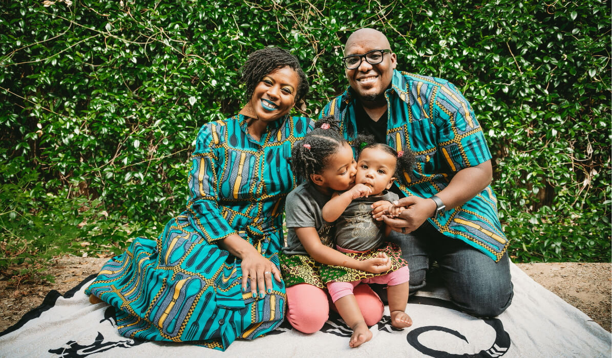
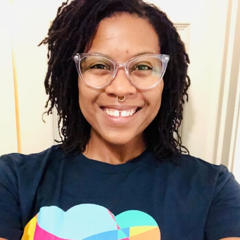
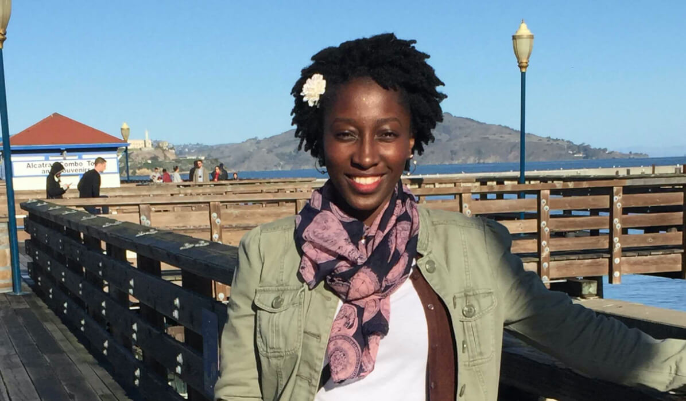
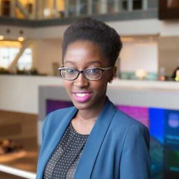
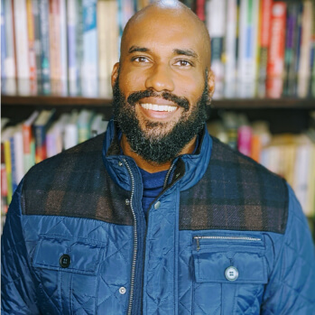

## Shruti Chaturvedula

Senior product manager

“Fun fact, when I was younger, I was not somebody who thought I would be an engineer at one point of time.” [Shruti Chaturvedula](https://www.linkedin.com/in/shruti-chaturvedula-975b50145/), a [Flywheel](https://getflywheel.com/) Senior Product Manager, started her career in fashion. In India, many colleges require applicants to take entrance exams and rank those applicants based on scores. For Shruti, she needed to take an entrance exam to pursue her education in fashion. After ranking very well across thousands of applicants from all over India, she was ready to pursue her education in fashion. Her mother, however, reminded her of the challenges within the industry, including having to know the right people, so she encouraged career paths traditional to people in India. After that conversation, Shruti made the decision to change career paths.

Shruti moved to Oklahoma City to pursue her Bachelor’s of Science in Electrical Engineering at the University of Oklahoma. While there, she started an internship with a global technology company that outsourced employee medical claims from its headquarters to Oklahoma. She worked on claims, while also working closely with the IT department. “That’s when my love story with problem solving started,” Shruti shared. Her interest in process improvement and ability to translate business to technology, and vice versa, helped her land a full-time business analyst role.

While Shruti credits that internship as where the love story began, that story evolved even further at the next company. She began that new chapter at a Fortune 500 technology company, starting as a business analyst. Within a year, Shruti was promoted to a Technical Product Manager, which introduced her to Agile. When she took the position, the company was starting to implement the Agile Method. This gave her the opportunity to level up and become a Certified Product Manager and Scrum Master. Over the course of a few years, Shruti was promoted to a higher level Product Manager.

This ultimately ended when Shruti’s husband found a job in Nebraska that required them to move. She took a job as a Product Owner for an insurance company, though quickly realized that her career growth opportunities there were limited. Shruti kept her options open, until a friend suggested she should look at Flywheel.

With a quick glance at the Life at Flywheel blog, Shruti just knew Flywheel was the place she had to be. “I was stalking Flywheel’s careers page for, I don’t know, about six months and I had alerts set up”, she said. Once a window opened, Shruti didn’t hesitate to jump on the opportunity. “I did something that I’d never done before, which was actually reach out to the Manager of Product at the time. I introduced myself to her via email. I said, ‘here’s why I think you should hire me’. Luckily for me, I did get a callback once I applied”, she recalled.

Shruti reminisced about her interview panel with a trio of Flywheelers that she continues to work with every day, recalling how kind they were. She was nervous during the interviews, but still felt at home. A week later, she got the call and said “hell yes” to the job!

Now, Shruti manages a pair of teams — Momentum and Billing, both important to the Flywheel platform. Her day-to-day includes finding any and all opportunities for process improvements, identifying and researching new projects, and facilitating those projects. This involves identifying a problem, working with designers and stakeholders to come up with a solution, and engaging engineers to build, test and implement the solution and improve the platform.

For Shruti, being a Product Manager makes sense. Her top five Gallup Strengths are Empathy, Arranger, Maximizer, Achiever, and Strategic. With these traits, she feels her job is a perfect mix of all of those strengths.

“Outside of work, people know me as the planner. I have lists on top of lists. I like arranging stuff. So, I think it kind of falls into the right place because it makes it easier for me to look at a problem and say, ‘Okay, I’m going to divide this up. I’m going to chop it up into lists, this is how I’m going to prioritize it.’”

> Though on the positive side, Shruti says, “The scope of things that you can automate is endless. That makes me excited because there are so many different ways of solving a problem.”

Looking forward, Shruti is fascinated by the future of technology, especially in regards to automation. While exciting, automation comes with an edge. She warns about the dangers of dependency, like on electrical appliances and the internet, explaining that many couldn’t function on a daily basis without these technologies.

Though Shruti’s journey started with fashion, through electrical engineering, and now as a Senior Product Manager at Flywheel, there were moments where racial identity played a role in her career. At a previous employer, Shruti experienced situations where it didn’t always feel like the ability to do a job was the deciding factor, especially for promotions.

Shruti received great performance reviews and praise for the work she provided, but when it came to promotions, a colleague who joined the team after Shruti was promoted. It took an additional year for Shruti to see a promotion.

“I don’t know if it’s because of a language barrier, or if it’s because I am not American, or whatever it is. I feel like sometimes opportunities don’t come as easily to me as they would if you were somebody who was white,” she recalled, “That makes your imposter syndrome go all the way high and then you kind of have these like things in your head. You’re like, ‘Am I not good enough? What am I doing wrong? Is this racial?’ You have that thought, ‘Is this just because I’m not white? Is that the reason why I’m not even considered?’”

Looking back, there are some things Shruti would say to her younger self. She shared that Indian culture frowns upon talking about oneself, as it comes across as bragging. In her youth, she would avoid celebrating wins and would move on from accomplishments, and she still feels awkward when receiving praise.

“My advice to my younger self is to believe in yourself. Be confident. It’s okay to celebrate your successes, because you are your biggest cheerleader. And if you don’t do it for yourself, nobody else will do it for you. You have to love yourself, you have to be confident in yourself first. You should be able to celebrate all of your successes, because you’ve worked hard for it. And I would probably change that, because I’ve never done that before.”

When it comes to Rise, Shruti feels represented now more than ever. “I like the fact that we actually have a place that makes me feel like, ‘Hey, you’re not different, you’re included’. I have never worked in a company before that took D&I this seriously”, she shared, “It just amazes me that there’s so much thought behind it, thinking about these underrepresented groups and making them feel like, ‘Hey, you have a voice at the table, you have a seat at the table, we’re listening to you. We’re here for you.’”

2020 has thrown plenty of unique wins, losses, and challenges, but a months-long quarantine? Shruti has spent her quarantine joining the “organization movement” and found herself watching The Home Edit and Marie Kondo.

“I like it. It keeps me sane. I’m somebody who enjoys the clean process and having things laid out perfectly. So that’s the one thing that I’m binging along with everybody else who is obsessed with organizing,” Shruti laughed.

---

## Carmen Johnson

Senior customer success manager

[Carmen Johnson](https://www.linkedin.com/in/carmenjohnson512/) graduated from the University of Texas at Austin with a bachelor’s degree in Spanish Language and Literature in 2010. Her fellow graduates were moving onto teaching roles after graduation, and Carmen didn’t feel that was her niche. She explored her options and decided to look into a role within corporate America. This led to her three-year stint at Bank of America where she gained experience in customer service working as a teller and a manager. After a little reflection, Carmen decided corporate America might not be her “jam.”  At this time, her husband was working for a Software as a Service start-up. This opened her eyes to a potential career that wasn’t with a big corporation, but that still offered the security of one in addition to other opportunities that weren’t as accessible in a corporate role.

“I was really bought into the idea of working with a small company that had more of a scrappy workflow versus some big organization with everything figured out where you’re just going through a lot of red tape to get anything accomplished,” Carmen explains.

Shortly after this realization, Carmen started at a SaaS start-up in 2013 where she laid the foundation for learning “tech tasks.” She then welcomed her first baby girl into the world, took some time off, and went back into the tech start-up world at a company called Bound. In November of 2018, she found herself at [WP Engine](https://wpengine.com/home-2020/?wpe-expid=112464) in a customer success role. She is currently a Senior Customer Success Manager in Austin.

Throughout Carmen’s career she believes there may have been times where her race played a factor in how she was treated. She is thankful that she has no memories of dealing with overt racism at work, but has definitely encountered implicit bias in the workplace. She would often receive comments about her attitude or tone being too “abrasive” or “direct.”

She talks about one specific time where she was “coached” by a superior to “‘tone it down’ or maybe ‘watch my tone’ to prevent my message from being ill-received,” she explains. “That’s dog whistle type language, whether intentional or not.” She goes on to explain, “I don’t think that this was necessarily someone who had nefarious intent by saying that, but I do think there are blind spots that people have and biases that they have accumulated over their lifetime which drive a lot of their views and interactions with certain people.”

Carmen says experiences like these have shaped her decisions in how she chooses to communicate in professional settings. “It means always being aware of how someone might be misinterpreting what I’m saying and just trying to be on the offense,” she explains. “But I also take the stance that I know my intent and I know that my approach also gets stuff done.”

When Carmen is asked about the future of technology you can see her excitement start to build, her posture becomes straighter and her smile widens. She’s clearly passionate about the topic. Carmen wholeheartedly believes to ensure a positive technical future we must expose kids early to opportunities in the tech world, especially those kids in underprivileged communities.

> For every generation you have the things that generation has to deal with, but I feel that this is a very pivotal time because of the role technology is playing. Technology is such an incredible vehicle for change, for advancing social justice causes and righting societal injustices. I feel like technology is the core of that. And that’s so exciting to me.

Carmen’s goal is to utilize the technology already in kids’ lives and bring specific skill lessons to their living rooms, bedrooms, or schools. “You don’t have a lot of the same obstacles of not being able to go to the physical program or building. Maybe there’s a tutor or a resource that’s in another state, or that’s not local to you that you wouldn’t otherwise have access to. All of that’s not the case anymore,” Carmen explains. “I think that’s also been a great equalizer - forcing everything to the digital format.” She wants to leave the younger generation with the impression that there is a possible future for them in the tech world, and to equip them with the skills and opportunities to achieve it.

Carmen is currently Co-Chair of WP Engine’s employee resource group, Roar, which represents women in tech. “One of our core pillars is empowering, advocating, and furthering opportunities for women and young girls in tech,” Carmen details.

Carmen relates this to her own experience, “I had never heard of tech startups or that tech was something I could do, or that it was a career path I could take. It seemed so far out of the realm of possibility.”  She continues, “Had I only been exposed to it at a younger age - what could I have accomplished by now? I’m very proud of what I’ve done, but it just reinforces that the exposure at as early an age as possible is really key.”

Carmen has also been working with a non-profit organization called Code2College that focuses on high school students in underrepresented communities. This program primarily teaches, but is not limited to, Black and Latino females, and focuses on how to code, business skills, resume writing, and how to succeed in an interview. For the top performing students, they also assist in obtaining a paid internship while they are still in high school.

One obstacle Code2College and the Austin tech community had to tackle during the Covid-19 pandemic was to provide access to computers and WiFi for their students. Carmen explains that there are, “very real barriers that a lot of students and people have just with access to the internet and computers. That’s something Code2College had to overcome. A lot of their students didn’t have laptops at home.” She continues, “They had to get dozens of computers for all their students. Fortunately, the Austin tech community rose up, and they were able to secure one for every student in the program.”

Carmen continues to advocate for the youth of today to gain exposure to technology. “The next generation are the ones who are going to carry our work to the next level, and envision things and ways to implement change that we can’t even imagine right now. And the fact that we get to play an active role in helping guide and nurture that in them is so incredibly important,” Carmen exclaims.

Carmen is inspired by her younger self and her two daughters. She explains the hesitation she had at a young age to take a chance on something she may not have figured out all the way. “It has been a recurring theme of my life, that I have chosen not to pursue certain goals or opportunities because I let doubts about ‘what I lacked’’ stop me.”

She elaborates that this hesitation and fear is especially true for many women, saying, “That’s just not something men do. They have mastered this sense of ‘I can do all the things! I’m super unqualified for this, but hey, I’ll figure it out!’” Carmen hopes to change this internal dialogue for her daughters. “I’m determined and am actively working to change that narrative with my daughters.”

If she could give one piece of advice to her younger self, it would be, “Don’t be afraid to pursue opportunities because of all the have-nots. It’s okay, you don’t have to have it all figured out, Young Carmen. But try the thing, DO THE THING. Refuse to let fear of the unknown stop you.”

---

## Hauwa Muibi

Data platform engineer

Hauwa Muibi developed a passion for problem-solving in childhood. She explains that growing up as the oldest child, “I’ve just always been expected to fix things.” She realized over time that the technology field was full of similar opportunities.

[Hauwa](https://www.linkedin.com/in/hauwa-muibi-b3a3a758/) is a Data Platform Engineer at [Spreetail](https://www.wearespreetail.com/), an ecommerce company headquartered in Lincoln, Nebraska. Her role is crucial to transforming what she describes as raw, transactional data into a usable data source to act as a source of truth. She describes the importance of getting the details right, saying “you’re making decisions that affect the company long term by using trusted and curated data.”

Hauwa first entered into tech by completing her Bachelor’s degree in Computer Engineering from Wilberforce University, a Historically Black University in Ohio. Her education included a mixture of hardware and software engineering, but she wanted to focus more on the software side of things. This led her to enter the Management Information Systems graduate program at the University of Nebraska at Omaha (UNO), with a concentration on data management.

Her experience at an internship during graduate school solidified Hauwa’s passion for analyzing data. Hauwa interned at Union Pacific as a Data Analyst where she modeled potential profit losses. Her forecast gave her experience interacting with end-users to iterate on the model, allowing her to get a feel for the software development lifecycle. The iterative process to find the right solution excited her about the potential for data. “I think that without that internship I wouldn’t have been able to know what I really liked and what I wanted,” she reflected.

She enjoyed the experience so much that she stayed on full-time with Union Pacific for three and a half years before moving on to her current role at Spreetail. She says, “I derive joy from knowing that my work was going to aid somebody’s job and aid them in doing a better job.”

Data engineering is an often misunderstood role at tech companies and Hauwa has worked hard to relay its importance. Within a company, if multiple groups are trying to answer business questions using different datasets, “it should trouble you as a decision maker in the company.” She warns that “eventually it’s going to be disastrous.” Hauwa says that although getting consolidated, reliable data is a difficult task, the payoff is worth it in the end to ensure trust in decisions.

Hauwa takes on ambitious data problems in her daily work while simultaneously taking on gender and racial inequalities in tech. “I’m very, very passionate about bridging that gap in gender disparity,” she says, noting that she’s often the only woman in the room. Hauwa describes how working in tech can be further isolating as a Black woman, saying, “it’s that added layer of not only being the only woman — but also sometimes being the only Black woman in a sea of people.”

When Hauwa was in graduate school she began to notice how unrepresentative her classes were. “UNO is a much bigger school than Wilberforce,” she explains, “that was when I started to see that in the class of 15 and 20 there’d be like, two women in class and I started asking why? Why is this?”

This concerned Hauwa, leading her to seek out ways to promote gender equity. One of those ways is through CodeCrush, a program run by UNO that was designed to introduce underrepresented groups to the world of Science, Technology, Engineering, and Mathematics. Hauwa learned about this program during her time at UNO and still volunteers today. She is also a board member for Mystery Code Society, an organization aimed at creating gender equity in tech by offering free coding classes to women, femmes, and non-men. In addition to her duties as a board member, she takes on the roles of program organizer, speaker, and teacher’s assistant for various classes Mystery Code Society runs each year.

While at Union Pacific, Hauwa also volunteered for a speaker series focused on women’s empowerment and women in technology. The series, aimed at young girls in late elementary to middle school, explored various roles in tech and the personal experiences that women have had in the field. Her dedication to closing the gender gap is evident.

> If I can encourage three or four of them who have that passion to pursue it regardless of expectations of society, then I know that I’m doing the right work. In 10 years, they’ll be here and they’ll be continuing to pass the torch down.

As Hauwa continues her work to bring more women into technology, she has also recognized the difficulties of racial inequality. Reflecting back on her time in tech, she would notice when she was the only Black person in the room. This affected Hauwa in various ways throughout her education and career, saying that she would often voice her opinion, but it would be overlooked or ignored. She would then hear that same opinion from another person and notice how much better it was received. This caused her to struggle at times, saying “I started to feel like my opinions weren’t valid.”

Hauwa would doubt herself to the point of not wanting to share her thoughts. On occasions when she did share, her ideas were often questioned more than others in a way that would feel like an attack. “I didn’t have the tools to combat it,” she says, “I think I accepted it in some way.”

Reflecting on how racial bias and microaggressions have affected her over the years, Hauwa has turned her attention to combating them in tech. One of her goals is to “bring more people of color into the conversation and to encourage more people of color to pursue tech careers.” Hauwa wants to be a welcoming voice to people who may not have ever considered a career in technology for themselves before. “I think that it’s always nice when there are allies, but also when there are people that look like you in the room.”

Hauwa’s incredible passion for solving tough problems allows her to thrive in data and community challenges. She encourages those seeking a career in technology to thrive in their own ways by being assertive and cultivating a spirit of self-motivation. “You don’t know how easily your voice is beaten down,” she says, “until one day you find something that you’re supposed to speak up about and you don’t even know how to do it.” Hauwa says believing in yourself is important and that you can gradually lose your voice over time. Her message of empowerment she gives to others is to remind them that “I should deserve to say how I feel about this" and "I deserve to continuously talk about it.”

---

## Anjuan Simmons

Engineering coach

[Anjuan Simmons](https://twitter.com/anjuan) is an Engineering coach at [Help Scout](https://www.helpscout.com/), a customer support software company whose mission is “... to empower businesses with tools that serve people in the most human, helpful way”. His role as an Engineering coach is to guide a cross-functional team of software developers by helping them ship delightful features to customers while also guiding their individual careers.

Anjuan graduated from the University of Texas at Austin, and his first job out of college was working as a technology consultant at Accenture (formerly known as Andersen Consulting). He spent just over a decade working there learning how to implement enterprise software applications, build and deploy software at scale, and lead large development teams. Anjuan left Accenture to earn his MBA from Texas A&M University. After receiving his degree, he briefly returned to consulting at Deloitte, but he found himself drawn to the world of startups. Anjuan’s management style draws from what he learned working at large and small companies.

Anjuan explains how his prior experiences helped shape how he works, explaining, “I took the rigor and the discipline of Accenture and Deloitte-sized companies and I applied that to startups. This also helped me understand how to be scrappy, how to wear lots of hats and get things done. That’s still a big part of my style.”

As he nears the 25 year mark building software for a living, Anjuan thinks back to how he was shaped for a career in tech. When he was in junior high, his favorite television show was “Star Trek: The Next Generation” which starred Levar Burton as Geordi La Forge, the Chief Engineer of the Starship Enterprise. “I think seeing a Black man managing and being responsible for the technology on a starship  in this futuristic world definitely had an impact on me.”

Fast forwarding a few years to high school, Anjuan was part of a program designed to help Black students consider careers in engineering. As part of this program, Black professionals from his home town of Wichita Falls, TX would come to his school and talk to the students about their careers. “All of that helped me see people who looked like me in the tech industry, and they were instrumental in my decision to study engineering and get into software development.”

Based on his early experiences, Anjuan strongly believes that representation matters for young Black, Indigenous, People of color (BIPOC). He’s held onto that belief, even to this day when he speaks at tech events. “Being part of representation is one reason why I decided to speak at tech events, and I’ve given talks all over the world. I want to be there for that young person who was wondering if they have a place in tech and, by seeing me, I hope that they can see themselves.”

For Anjuan, racial bias isn’t a foreign concept. In fact, it’s something he’s dealt with his entire life, both in and out of the workplace. Early in his career at one of his previous jobs, he was a team lead responsible for the technology implementation and also managing the people on his team. One of the client managers walked up to one of the junior developers on the team and addressed him as if he was the team lead — the junior developer happened to be white. “Not being given the benefit of the doubt, not being given the assumption of competence and the ability to lead — I’ve dealt with that for my entire career.”

He has, however, overcome this in a few ways. “I focus on being hypercompetent and making sure that my work is as impeccable as possible. However, that’s also part of the burden of being Black. I know that being perfect is usually the minimum for being accepted and any error can be career-ending. Having to walk that tightrope is just part of how I’ve dealt with racial bias. Also, I’m always aware that I may be the first Black technology professional that a client, customer, or employee has ever seen so I’m immediately an unknown entity, and it’s human nature to fear what you don’t know. Furthermore, knowing that I may be the first Black person to lead a team of non-Black people is part of the burden of leading while Black and coding while Black. I think, like many Black people in technology, we’ve learned to shoulder these burdens because what other choice do we have?”

Despite the racial bias and other challenges he’s faced over his nearly quarter century in tech, Anjuan remains hopeful. “I’m not blind to the challenges or the fact that racial bias is such a pernicious problem in the technology field. For example, we know that artificial intelligence and machine learning and other powerful tools are taking our biases with them because they’re coded by people who have biases. We’re using AI to do things like decide court cases, who’s guilty or not guilty, who goes free or who stays in prison, who gets into college or who doesn’t get into college, and they’re making algorithms for who gets hired or who gets fired. We have to be aware that biases are very real and we face the threat that we may permanently bake them into these powerful tools that we’re bringing to bear on so many parts of our lives. What I’m hopeful about is that we’re becoming more aware of these biases and people are having conversations about what we can do to remove our human biases from these machine algorithms.”

Anjuan is also excited about the opportunity for virtual reality to be a way to help people understand how biases impact how we live. He’s always wanted to find a VR experience where someone could put on a headset and “walk” into an experience where they live life as another person (another gender, another race, with/without a disability, etc). The VR simulation could help them experience microaggressions, and how people responded to the way they look. “I think that technology has the capability and the potential to expose people to experiences that can help you see life through someone else’s eyes. Once people can actually do that, literally be an “other”, I think that will be so powerful.”

When asked what Rise and other tech companies can be doing to be better allies for underrepresented groups, representation was again a common theme. “I think what you’re doing now with the newsletter is providing visibility to people who you don’t often see on the cover of magazines or CNN when they bring in the tech expert. All too often, you only see Black technologists when we’re talking about inclusion and diversity. I think profiling people and bringing their careers and expertise as technologists is so powerful. I really encourage you to keep doing that.”

He also encouraged tech companies to create separate Slack groups or channels for employees of color or underrepresented racial groups to have a place to come together. “Most tools like Slack give you the ability to create either channels or rooms. Creating spaces for people of color or for other underrepresented groups where they can have a private place to talk, share, and be honest with each other is  super powerful. At Help Scout, we have a couple of Slack channels for Black employees and people of color. I think that’s a simple thing you can do to give people a place where they can share and be their authentic selves with people who look like them.” Along with having safe spaces, Anjuan challenges companies to address difficult issues head-on.

> I think that’s something that Rise and other people in the tech community can do to be better allies — understand the history of the people you’re trying to ally with.

Anjuan shared some amazing advice that he would give to his younger self, the young electrical engineering graduate — treat yourself like a startup. “A startup is an idea that doesn’t have a lot of resources, but has a lot of energy and hope and drive and they are doing something to hopefully attract funding to become the realization of that idea.”

He even referenced big companies that began as startups in garages and are huge companies now. ”Those companies started and continued to thrive because they are willing to understand that you have to produce a product that people need. They may not even know that they need it, but they need it and you have to put together a story around that product and how you can get that product to the people that need it.”

Anjuan strongly believes if you apply this idea of growing and scaling a startup to yourself in your career in tech, you’ll be able to accomplish amazing things. “You have to understand technology, you have to understand marketing, and you have to understand sales. There are people who need what you offer and they don’t even know it yet. If you dig deep and learn the technology industry that you’re going into and develop the skills that are needed by the industry, and understand how to market yourself, how to network, how to get funding, and how to sell yourself, then you’ll be able to get out there and really accomplish something. You’ll not only have a long career in the technology industry, but you’ll be able to lend your voice to that industry, too, and that voice has value.”

When asked what advice he has for the Black community at large, this is what Anjuan has to say to that community specifically. “I’ve been super lucky. I come from a very modest background, and I’m very fortunate and blessed to live quite well. I work in an industry that pays way more than the average, I’ve been able to gain the ability to create wealth, and that’s why I’m talking to you because I want you to hear this. I want you to know that you come from people who are strong, you come from people who have grit, and if you take hold of that grit, that grit that your ancestors needed to survive and apply it to your today experiences, then you’ll be able to overcome it as well. We have overcome so much with so little, and we have the ability to use the tools now available to us through technology to forge a future that’s bright and full of promise.”

